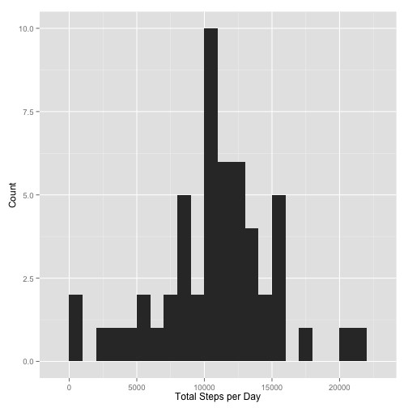
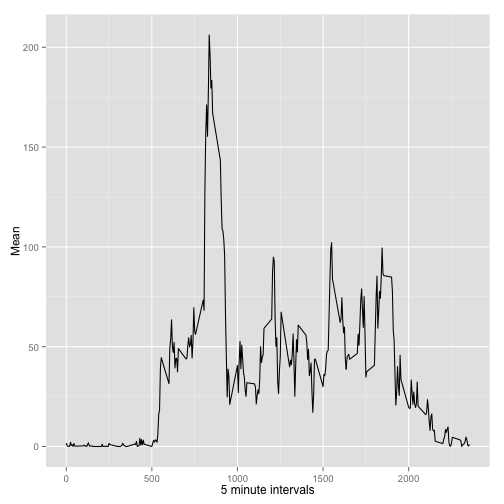
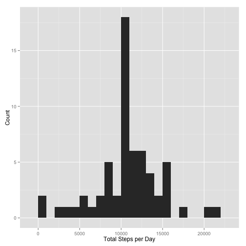
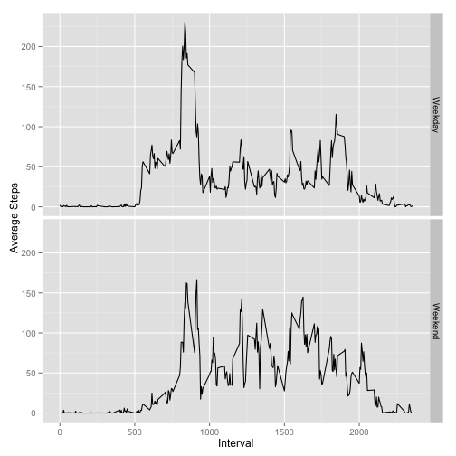

# Reproducible Research: Peer Assessment 1

```r
options(scipen = 1, digits = 2)
```

## Loading and preprocessing the data

### Load in the data

```r
## Read in the data
activity <- read.csv(unzip("activity.zip"))
## Convert the dates to POSIXct class and the steps to numeric
activity$date <- as.POSIXct(activity$date)
activity$steps <- (as.numeric(activity$steps))
```

**This is what the data looks like:**

```r
head(activity)
```

```
##   steps       date interval
## 1    NA 2012-10-01        0
## 2    NA 2012-10-01        5
## 3    NA 2012-10-01       10
## 4    NA 2012-10-01       15
## 5    NA 2012-10-01       20
## 6    NA 2012-10-01       25
```

```r
summary(activity)
```

```
##      steps           date                        interval   
##  Min.   :  0    Min.   :2012-10-01 00:00:00   Min.   :   0  
##  1st Qu.:  0    1st Qu.:2012-10-16 00:00:00   1st Qu.: 589  
##  Median :  0    Median :2012-10-31 00:00:00   Median :1178  
##  Mean   : 37    Mean   :2012-10-31 00:25:34   Mean   :1178  
##  3rd Qu.: 12    3rd Qu.:2012-11-15 00:00:00   3rd Qu.:1766  
##  Max.   :806    Max.   :2012-11-30 00:00:00   Max.   :2355  
##  NA's   :2304
```

## What is mean total number of steps taken per day?

### Plot a histogram of the total steps per day

```r
require(ggplot2)
```

```
## Loading required package: ggplot2
```

```r
require(plyr)
```

```
## Loading required package: plyr
```

```r
sum <- ddply(activity, .(date), summarize, sum.steps=sum(steps))
p <- qplot(sum.steps, data=sum, binwidth=1000, xlab="Total Steps per Day", ylab="Count")
p
```

 

### Calculate the mean and median

```r
mean.activity <- mean(sum$sum.steps, na.rm=TRUE)
median.activity <- median(sum$sum.steps, na.rm=TRUE)
```

**The mean number of steps per day is 10766.19.**
**The median number of steps per day is 10765.**

## What is the average daily activity pattern?

### Plot a time series of the mean steps take for each 5 minute interval

```r
time <- ddply(activity, .(interval), summarize, mean=mean(steps, na.rm=TRUE))
p <- qplot(interval, mean, data=time, geom="line", xlab="5 minute intervals", ylab="Mean")
p
```

 

### Find which interval has the max number of steps 

```r
max.steps <- time[time$mean==max(time$mean),]
```

**The interval with the most steps is 835 with 206.17.**

## Imputing missing values

### Calculate the number of missing values

```r
## Calculate missing values
complete <- complete.cases(activity)
num.NAs <- as.data.frame(table(complete))
```

**There are 2304 NAs in the data.**

### Replace the NAs with the means of the same interval from other days

```r
nas <- activity[is.na(activity$steps),]
imputed.nas <- join(nas,time, by="interval")
imputed.nas$steps <- imputed.nas$mean
imputed.nas$mean <- NULL
non.nas <- activity[!is.na(activity$steps),]
```

### Create a new dataset with the missing data filled in

```r
new.activity <- rbind(non.nas,imputed.nas)
```

**This is what the data looks like:**

```r
head(new.activity)
```

```
##     steps       date interval
## 289     0 2012-10-02        0
## 290     0 2012-10-02        5
## 291     0 2012-10-02       10
## 292     0 2012-10-02       15
## 293     0 2012-10-02       20
## 294     0 2012-10-02       25
```

```r
summary(new.activity)
```

```
##      steps          date                        interval   
##  Min.   :  0   Min.   :2012-10-01 00:00:00   Min.   :   0  
##  1st Qu.:  0   1st Qu.:2012-10-16 00:00:00   1st Qu.: 589  
##  Median :  0   Median :2012-10-31 00:00:00   Median :1178  
##  Mean   : 37   Mean   :2012-10-31 00:25:34   Mean   :1178  
##  3rd Qu.: 27   3rd Qu.:2012-11-15 00:00:00   3rd Qu.:1766  
##  Max.   :806   Max.   :2012-11-30 00:00:00   Max.   :2355
```

### Plot a histogram of the total steps per day using the data set with missing values removed

```r
sum.new <- ddply(new.activity, .(date), summarize, sum.steps=sum(steps))
p <- qplot(sum.steps, data=sum.new, binwidth=1000, xlab="Total Steps per Day", ylab="Count")
p
```

 

### Calculate the mean and median

```r
new.mean <- mean(sum.new$sum.steps, na.rm=TRUE)
new.median <- median(sum.new$sum.steps, na.rm=TRUE)
```

**The new mean number of steps per day is 10766.19. The new median number of steps per day is 10766.19.**

**The difference between the means with and without missing data is 0 and the difference between the median with and without missing data is 1.19.**

**The impact of imputing the missing values is that the median increased and is now the same as the mean. A comparison of the old histogram to the new also shows an increase of values around the middle of the distribution.**

## Are there differences in activity patterns between weekdays and weekends?

### Create a new variable that classifies the dates into "weekend" or "weekday"

```r
new.activity$weekday <- weekdays(new.activity$date)
table(new.activity$weekday)
```

```
## 
##    Friday    Monday  Saturday    Sunday  Thursday   Tuesday Wednesday 
##      2592      2592      2304      2304      2592      2592      2592
```

```r
new.activity$day.type <- "Weekday"
new.activity[new.activity$weekday=="Saturday" | new.activity$weekday=="Sunday", ]$day.type <- "Weekend"
new.activity$weekend <- NULL
```

### Plot a time series showing the average steps per day comparing weekdays to weekend days

```r
time.weekday <- ddply(new.activity, .(interval,day.type), summarize, mean=mean(steps, na.rm=TRUE))
p <- ggplot(data=time.weekday, aes(x=interval, y=mean))
p <- p + geom_line() + facet_grid(day.type~.) + xlab("Interval") + ylab("Average Steps")
p
```

 

